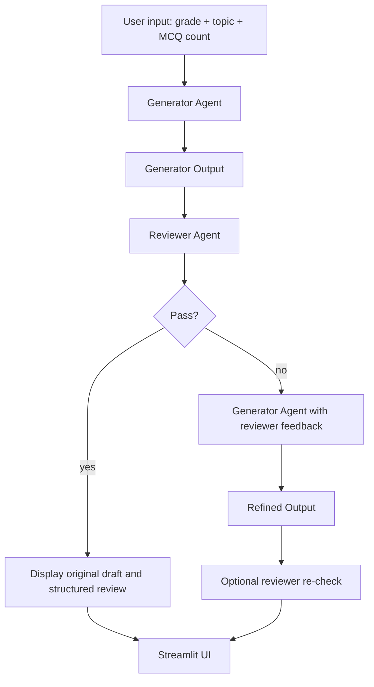

# Eklavya AI Content Pipeline

This repository contains the original Part 1 pipeline and the governed Part 2 upgrade. Part 1 remains documented here so the original architecture and behavior are preserved, while Part 2 is the implemented backend path for the auditable RunArtifact workflow.

## Part 1 Legacy Architecture

The Part 1 app is a two-agent Python pipeline for educational content. It drafts grade-appropriate educational material, reviews it for age appropriateness, conceptual correctness, and clarity, and performs one capped refinement pass if needed.

### What the Part 1 project does

- The Generator Agent accepts structured input and creates educational content for a selected grade and topic.
- The Reviewer Agent inspects that content and returns structured pass/fail feedback.
- The Orchestrator runs the pipeline, sends review feedback back into the Generator once, and stops after that single refinement pass.
- The Streamlit UI shows the pipeline stages, loading state, and the structured reviewer output.
- The FastAPI endpoint exposes the same pipeline as a service.

### Part 1 Architecture



### Part 1 Project Structure

```text
internship/
├── app.py              # Streamlit UI
├── main.py             # CLI entrypoint
├── orchestrator.py     # Generator -> Reviewer -> one refinement pass
├── schemas.py          # Pydantic request/response models
├── prompts/            # Prompt builders for both agents
├── agents/             # Generator and Reviewer implementations
├── api/server.py       # FastAPI wrapper
├── Dockerfile          # Deployment container
├── tests/              # Pytest coverage
└── README.md           # Combined Part 1 + Part 2 documentation
```

### Part 1 Data Contract

Generator input:

```json
{
	"grade": 4,
	"topic": "Types of angles",
	"mcq_count": 3
}
```

Generator output:

```json
{
	"explanation": "...",
	"mcqs": [
		{
			"question": "...",
			"options": ["A", "B", "C", "D"],
			"answer": "B"
		}
	]
}
```

Reviewer output:

```json
{
	"status": "pass",
	"feedback": [
		"Sentence 2 is too complex for Grade 4",
		"Question 3 tests a concept not introduced"
	]
}
```

### Part 1 UI Notes

The Streamlit sidebar lets you set the MCQ count, so the output is not locked to three questions unless you choose that value. The main page shows the generator loading state, reviewer loading state, structured reviewer JSON output, and refined output only when the reviewer fails.

### Part 1 Setup

```bash
python -m venv .venv
.venv\Scripts\activate
pip install -r requirements.txt
copy .env.example .env
```

The Part 1 code uses the same Groq-backed structured output pattern as the upgrade path, so the repository keeps the same runtime conventions throughout.

## Part 2 Governed Pipeline

Part 2 is the enhanced backend path. It uses stricter schemas, deterministic reviewer thresholds, bounded refinement, and full audit-trail persistence.

### Part 2 Overview

Part 2 extends the generator/reviewer workflow into a bounded, schema-validated, auditable pipeline. Every run records the draft content, each review, each refinement, the final decision, and timestamps in one stored artifact.

### Agent Roles

Generator: drafts grade-appropriate educational content as a strict GeneratorOutputV2 with an explanation, MCQs, and teacher notes. It uses structured Groq output and retries once if the response fails schema validation.

Reviewer: evaluates the draft quantitatively with 1-5 scores for age appropriateness, correctness, clarity, and coverage. The Python code computes the final pass value deterministically from those scores and rejects invalid feedback paths before continuing.

Refiner: rewrites a failing draft using reviewer feedback. It is bounded to at most two refinements per run, and every refinement attempt is recorded in the run artifact.

Tagger: classifies approved content only. It runs only when the final status is approved and produces indexing metadata for the stored artifact.

### Pass / Fail Criteria

The reviewer uses these thresholds:

- all four scores must be at least 3
- correctness must be at least 4

That means a run only passes when the content is broadly adequate across the board and the factual quality is held to a stricter bar than the other dimensions.

### Orchestration Decisions

The Part 2 orchestrator uses a bounded loop, not an open-ended retry cycle. It performs the initial review plus up to two refinements, which yields at most three review cycles total. The control flow stops explicitly when content passes, when the refinement cap is reached, or when generation or refinement fails schema validation.

GET /history accepts an optional user_id tag. If omitted, the API returns every stored artifact; if present, it returns only that user's runs, most recent first. This is intentionally a filtering tag rather than a full auth system.

### Trade-offs

Persistence stores the full RunArtifact as JSON in SQLite with a small set of indexed columns for lookup. That keeps the implementation simple while preserving the complete audit trail and leaving a clean path to Postgres later.

user_id is treated as a lightweight history tag rather than a login system. That matches the scope of the assessment and avoids adding auth infrastructure that the spec did not ask for.

The repository keeps the Part 1 code alongside Part 2 instead of deleting it. That preserves the original implementation for reference while making the governed Part 2 path the primary backend flow.

### Live Output

The JSON below is the exact output captured from `output.json` for a real end-to-end run on Grade 5, "Fractions as parts of a whole". It ended with `rejected`, so the Tagger did not run and `final.tags` stayed `null`.

```json
{
	"run_id": "2b7eaada-06aa-4e5e-90fb-87f8645eb26d",
	"input": {
		"grade": 5,
		"topic": "Fractions as parts of a whole",
		"user_id": "default_user"
	},
	"attempts": [
		{
			"attempt": 1,
			"draft": {
				"explanation": {
					"text": "Fractions are a way to show part of a whole. Imagine you have a pizza that is cut into 8 slices, and you eat 2 of them. You can write this as 2/8, which means you ate 2 slices out of the total 8 slices. The top number, 2, tells us how many slices you ate, and the bottom number, 8, tells us how many slices there were in total. We can also simplify fractions to make them easier to understand. For example, 2/8 can be simplified to 1/4 by dividing both numbers by 2.",
					"grade": 5
				},
				"mcqs": [
					{
						"question": "If you have a cake that is cut into 12 pieces and you eat 3 of them, what fraction of the cake have you eaten?",
						"options": ["1/4", "1/3", "1/6", "2/3"],
						"correct_index": 1
					}
				],
				"teacher_notes": {
					"learning_objective": "To understand that fractions represent parts of a whole and to be able to write and simplify fractions",
					"common_misconceptions": [
						"Thinking that the top number of a fraction always has to be smaller than the bottom number"
					]
				}
			},
			"review": {
				"scores": {
					"age_appropriateness": 1,
					"correctness": 1,
					"clarity": 1,
					"coverage": 1
				},
				"pass": false,
				"feedback": []
			},
			"refined": {
				"explanation": {
					"text": "Fractions are a way to show part of a whole. Imagine you have a pizza that is cut into 8 slices. If you eat 2 of them, you can say you ate 2 out of 8 slices, or 2/8 of the pizza. This is a fraction. The top number, 2, tells us how many slices you ate, and the bottom number, 8, tells us how many slices there were in total.",
					"grade": 5
				},
				"mcqs": [
					{
						"question": "If a cake is cut into 12 pieces and you eat 3 of them, what fraction of the cake have you eaten?",
						"options": ["1/4", "1/3", "1/2", "3/12"],
						"correct_index": 3
					}
				],
				"teacher_notes": {
					"learning_objective": "To understand that fractions represent parts of a whole",
					"common_misconceptions": [
						"Thinking that the top number of a fraction always has to be smaller than the bottom number"
					]
				}
			}
		},
		{
			"attempt": 2,
			"draft": {
				"explanation": {
					"text": "Fractions are a way to show part of a whole. Imagine you have a pizza that is cut into 8 slices. If you eat 2 of them, you can say you ate 2 out of 8 slices, or 2/8 of the pizza. This is a fraction. The top number, 2, tells us how many slices you ate, and the bottom number, 8, tells us how many slices there were in total.",
					"grade": 5
				},
				"mcqs": [
					{
						"question": "If a cake is cut into 12 pieces and you eat 3 of them, what fraction of the cake have you eaten?",
						"options": ["1/4", "1/3", "1/2", "3/12"],
						"correct_index": 3
					}
				],
				"teacher_notes": {
					"learning_objective": "To understand that fractions represent parts of a whole",
					"common_misconceptions": [
						"Thinking that the top number of a fraction always has to be smaller than the bottom number"
					]
				}
			},
			"review": {
				"scores": {
					"age_appropriateness": 1,
					"correctness": 1,
					"clarity": 1,
					"coverage": 1
				},
				"pass": false,
				"feedback": []
			},
			"refined": {
				"explanation": {
					"text": "Fractions are a way to show part of a whole. Imagine you have a pizza that is cut into 8 slices, and you eat 2 of them. You can write this as 2/8, which means you ate 2 slices out of the total 8 slices. The top number, 2, tells us how many slices you ate, and the bottom number, 8, tells us how many slices there were in total. We can also simplify fractions to make them easier to understand. For example, 2/8 can be simplified to 1/4 by dividing both numbers by 2.",
					"grade": 5
				},
				"mcqs": [
					{
						"question": "If you have a cake that is cut into 12 pieces and you eat 3 of them, what fraction of the cake have you eaten?",
						"options": ["1/4", "1/3", "1/6", "2/3"],
						"correct_index": 1
					}
				],
				"teacher_notes": {
					"learning_objective": "To understand that fractions represent parts of a whole and to be able to write and simplify fractions",
					"common_misconceptions": [
						"Thinking that the top number of a fraction always has to be smaller than the bottom number"
					]
				}
			}
		},
		{
			"attempt": 3,
			"draft": {
				"explanation": {
					"text": "Fractions are a way to show part of a whole. Imagine you have a pizza that is cut into 8 slices, and you eat 2 of them. You can write this as 2/8, which means you ate 2 slices out of the total 8 slices. The top number, 2, tells us how many slices you ate, and the bottom number, 8, tells us how many slices there were in total. We can also simplify fractions to make them easier to understand. For example, 2/8 can be simplified to 1/4 by dividing both numbers by 2.",
					"grade": 5
				},
				"mcqs": [
					{
						"question": "If you have a cake that is cut into 12 pieces and you eat 3 of them, what fraction of the cake have you eaten?",
						"options": ["1/4", "1/3", "1/6", "2/3"],
						"correct_index": 1
					}
				],
				"teacher_notes": {
					"learning_objective": "To understand that fractions represent parts of a whole and to be able to write and simplify fractions",
					"common_misconceptions": [
						"Thinking that the top number of a fraction always has to be smaller than the bottom number"
					]
				}
			},
			"review": {
				"scores": {
					"age_appropriateness": 1,
					"correctness": 1,
					"clarity": 1,
					"coverage": 1
				},
				"pass": false,
				"feedback": []
			},
			"refined": null
		}
	],
	"final": {
		"status": "rejected",
		"content": {
			"explanation": {
				"text": "Fractions are a way to show part of a whole. Imagine you have a pizza that is cut into 8 slices, and you eat 2 of them. You can write this as 2/8, which means you ate 2 slices out of the total 8 slices. The top number, 2, tells us how many slices you ate, and the bottom number, 8, tells us how many slices there were in total. We can also simplify fractions to make them easier to understand. For example, 2/8 can be simplified to 1/4 by dividing both numbers by 2.",
				"grade": 5
			},
			"mcqs": [
				{
					"question": "If you have a cake that is cut into 12 pieces and you eat 3 of them, what fraction of the cake have you eaten?",
					"options": ["1/4", "1/3", "1/6", "2/3"],
					"correct_index": 1
				}
			],
			"teacher_notes": {
				"learning_objective": "To understand that fractions represent parts of a whole and to be able to write and simplify fractions",
				"common_misconceptions": [
					"Thinking that the top number of a fraction always has to be smaller than the bottom number"
				]
			}
		},
		"tags": null
	},
	"timestamps": {
		"started_at": "2026-07-26T13:24:31.614822",
		"finished_at": "2026-07-26T13:24:35.981255"
	}
}
```

## Setup

```bash
python -m venv .venv
.venv\Scripts\activate
pip install -r requirements.txt
copy .env.example .env
```

Add your Groq API key and optional database URL to `.env`.

## Running the API

```bash
uvicorn api.server:app --reload
```

## Running the CLI

```bash
python main.py --grade 5 --topic "Fractions as parts of a whole"
```

## Testing

```bash
.venv\Scripts\python -m pytest
```

The mandatory Part 2 tests cover:

- schema validation failure handling
- fail -> refine -> pass orchestration
- fail -> refine -> fail -> reject orchestration

## Environment Variables

```bash
GROQ_API_KEY=your-groq-api-key-here
GROQ_MODEL=llama-3.3-70b-versatile
DATABASE_URL=sqlite:///./part2_runs.db
GROQ_TEMPERATURE_GENERATOR=0.2
GROQ_TEMPERATURE_REVIEWER=0.0
DEMO_MODE=0
```