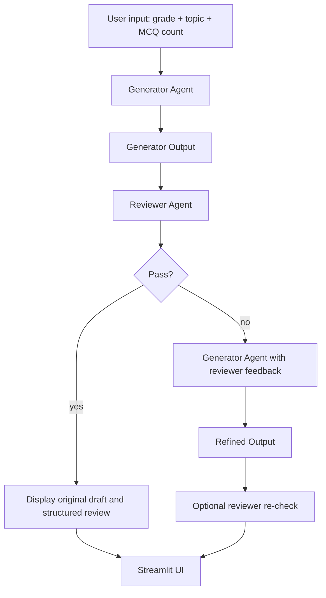

# AI Content Generator - Generator + Reviewer Pipeline

A two-agent Python app for the Eklavya internship assessment. It drafts grade-appropriate educational content, reviews it for age appropriateness, conceptual correctness, and clarity, and performs one capped refinement pass if needed. The submission is intentionally centered around a single README so the evaluator can understand the project without opening multiple design docs.

## What the project does

- The **Generator Agent** accepts structured input and creates educational content for a selected grade and topic.
- The **Reviewer Agent** inspects that content and returns structured pass/fail feedback.
- The **Orchestrator** runs the pipeline, sends review feedback back into the Generator once, and stops after that single refinement pass.
- The **Streamlit UI** shows the pipeline stages, loading state, and the structured reviewer output.
- The **FastAPI endpoint** exposes the same pipeline as a service if you want an API demo.

## Architecture



## Project structure

```text
internship/
├── app.py              # Streamlit UI
├── main.py             # CLI entrypoint
├── orchestrator.py     # Generator -> Reviewer -> one refinement pass
├── schemas.py          # Pydantic request/response models
├── prompts/            # Prompt builders for both agents
├── agents/             # Generator and Reviewer implementations
├── api/server.py       # FastAPI wrapper
├── Dockerfile          # Deployment container
├── tests/              # Pytest coverage
└── README.md           # Single-file project explanation
```

## Setup

```bash
python -m venv .venv
.venv\Scripts\activate
pip install -r requirements.txt
copy .env.example .env
```

Add your Groq API key to `.env`:

```bash
GROQ_API_KEY=your-key-here
GROQ_MODEL=llama-3.3-70b-versatile
```

## How to run

Run the Streamlit UI:

```bash
streamlit run app.py
```

Run the CLI for a quick check:

```bash
python main.py --grade 4 --topic "Types of angles"
```

Run the API:

```bash
uvicorn api.server:app --reload
```

Run with Docker:

```bash
docker build -t eklavya-ai-pipeline .
docker run -p 8501:8501 --env-file .env eklavya-ai-pipeline
```

## UI behavior

The Streamlit sidebar lets you set the MCQ count, so the output is not locked to three questions unless you choose that value. The main page shows:

- Generator Agent loading state and reason for work
- Reviewer Agent loading state and reason for work
- Structured reviewer JSON output
- Refined output only when the reviewer fails

That makes the flow visible in the exact way the PDF asks for.

## Data contract

Generator input:

```json
{
	"grade": 4,
	"topic": "Types of angles",
	"mcq_count": 3
}
```

Generator output:

```json
{
	"explanation": "...",
	"mcqs": [
		{
			"question": "...",
			"options": ["A", "B", "C", "D"],
			"answer": "B"
		}
	]
}
```

Reviewer output:

```json
{
	"status": "pass",
	"feedback": [
		"Sentence 2 is too complex for Grade 4",
		"Question 3 tests a concept not introduced"
	]
}
```

## Why the Reviewer gets grade and topic too

The PDF only shows the Reviewer receiving content JSON, but the evaluation criteria include age appropriateness and topic alignment. The project passes grade and topic through the Reviewer request so those checks are actually possible.

## Testing

```bash
pytest
```

The tests cover schemas, prompt generation, agent wiring, and the one-pass refinement orchestration.

## Deployment notes

- The repository includes a [Dockerfile](Dockerfile) so you can package the app easily.
- The `.gitignore` excludes virtual environments, caches, coverage output, and local environment files.
- If the assessment portal only accepts a file upload, zip the repo without `.venv` or `.env`.


## Design notes

- Structured input and output are enforced with Pydantic models.
- The orchestrator calls the Generator at most twice per request.
- The Reviewer can return pass/fail with structured feedback that is rendered directly in the UI.
- The MCQ count is configurable from the sidebar instead of being silently fixed in the UI.
